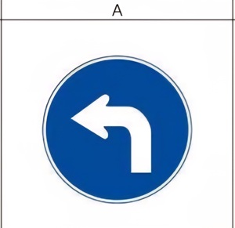
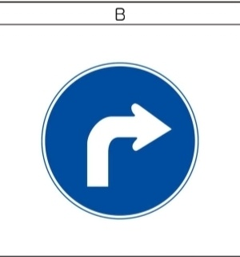

# Arrow Direction Detection

Python, OpenCV, ROS1을 활용하여 카메라 영상에서 화살표 표지판을 검출하고,
화살표가 가리키는 좌·우 방향을 판단하는 프로젝트입니다.

파란색 원형 표지판을 검출한 뒤 내부의 흰색 화살표 윤곽선을 추출하고,
윤곽선의 형상을 분석하여 화살표 방향을 판단합니다.

최종적으로 판단된 방향은 ROS Topic을 통해 `left`, `right`, `none` 형태로 출력합니다.

---

## 프로젝트 목적

자율주행 차량이 카메라를 통해 방향 표지판을 인식하고,
인식 결과를 이후의 주행 판단 및 제어 로직에서 활용할 수 있도록 구현하였습니다.

화살표 방향을 안정적으로 판단하기 위해 다음 세 가지 방식을 순차적으로 적용하고 비교하였습니다.

1. 화살표 윤곽선의 무게중심 기반 판별
2. 화살표 윤곽선의 끝점 기반 판별
3. PCA 기반 주축 및 Head/Tail 판별

현재 최종 코드에서는 **3번 PCA 기반 방식**을 사용합니다.

---

## 사용 기술

- Python
- OpenCV
- NumPy
- ROS1
  
---

## 테스트 이미지

### Left Arrow



### Right Arrow



카메라 영상에서 위와 같은 파란색 원형 표지판을 검출하고,
표지판 내부의 흰색 화살표 형상을 분석하여 방향을 판단합니다.

---

## 전체 동작 과정

### 1. 카메라 영상 수신

ROS의 `CompressedImage` 메시지를 통해 카메라 영상을 입력받습니다.

기본 입력 Topic:

```text
/usb_cam/image_raw/compressed
```

수신한 압축 이미지를 OpenCV에서 처리할 수 있는 BGR 이미지로 변환합니다.

---

### 2. 파란색 표지판 검출

입력 영상을 BGR에서 HSV 색 공간으로 변환한 뒤,
미리 설정한 파란색 HSV 범위를 이용하여 마스크를 생성합니다.

이후 Morphology 연산을 이용해 영상의 노이즈를 줄이고,
검출된 영역 중 가장 큰 contour를 표지판 후보로 선택합니다.

---

### 3. 표지판 ROI 설정

검출한 파란색 표지판의 Bounding Box를 기준으로
관심영역(ROI)을 생성합니다.

ROI 중심을 원의 중심으로 가정하고 원형 마스크를 적용하여
표지판 내부 영역만 영상처리 대상으로 사용합니다.

---

### 4. 흰색 화살표 검출

표지판 ROI 내부에서 흰색 HSV 범위를 이용하여 화살표 영역을 분리합니다.

이후 다음 영상처리 과정을 수행합니다.

- Morphology Opening
- Morphology Closing
- Canny Edge Detection
- Contour Detection

검출된 흰색 contour 중 가장 큰 contour를 화살표 후보로 사용합니다.

---

# 화살표 방향 판별 방식

프로젝트를 진행하면서 화살표 방향을 판별하기 위해
총 세 가지 방법을 적용하였습니다.

---

## 1. 화살표 윤곽선의 무게중심 기반 판별

첫 번째 방식은 화살표 contour의 **무게중심(Centroid)** 위치를 이용합니다.

OpenCV의 `moments()`를 이용하여 화살표 윤곽선의 중심을 계산합니다.

```python
M = cv2.moments(arrow_contour)

arrow_cx = M["m10"] / M["m00"]
arrow_cy = M["m01"] / M["m00"]
```

계산된 화살표 무게중심의 x 좌표와
표지판 ROI의 중앙 x 좌표를 비교하여 방향을 판단합니다.

```text
화살표 중심이 ROI 중앙보다 왼쪽  → left
화살표 중심이 ROI 중앙보다 오른쪽 → right
```

### 장점

- 구조가 단순함
- 계산량이 적음
- 구현이 쉬움

### 한계

화살표가 직선 형태가 아니라 꺾여 있는 형태이기 때문에
화살표 전체의 면적 분포에 따라 무게중심 위치가 달라질 수 있습니다.

따라서 무게중심만으로 실제 화살표가 가리키는 방향을 판단하기에는
한계가 있을 수 있습니다.

---

## 2. 화살표 윤곽선의 끝점 기반 판별

두 번째 방식에서는
**표지판 중심에서 가장 멀리 떨어져 있는 contour 점을 화살표 끝점(Tip)**으로 가정합니다.

먼저 화살표 contour를 여러 개의 점으로 변환합니다.

```python
pts = arrow_contour.reshape(-1, 2)
```

이후 표지판 ROI 중심에서 각 contour 점까지의 거리를 계산합니다.

```python
dx = pts[:, 0] - cx0
dy = pts[:, 1] - cy0

dist2 = dx * dx + dy * dy
```

가장 큰 거리를 가지는 점을 화살표의 끝점 후보로 선택합니다.

```python
idx = np.argmax(dist2)
tip_x, tip_y = pts[idx]
```

이후 끝점의 x 위치와 ROI 중심을 비교하여 방향을 판단합니다.

```text
Tip이 ROI 중앙보다 왼쪽  → left
Tip이 ROI 중앙보다 오른쪽 → right
```

### 장점

- 무게중심보다 화살표의 끝부분을 직접 이용할 수 있음
- 방향성이 비교적 명확한 화살표에서는 단순하게 적용 가능

### 한계

ROI 중심에서 가장 멀리 떨어진 contour 점이
항상 실제 화살표의 머리 부분이라고 보장할 수 없습니다.

영상 노이즈나 화살표 형상에 따라
다른 contour 점이 가장 먼 점으로 선택될 가능성이 있습니다.

---

# 3. PCA 기반 화살표 주축 및 Head/Tail 판별

최종적으로 사용한 방식입니다.

하나의 특징점만 사용하는 대신
**화살표 contour 전체가 어떤 방향으로 분포되어 있는지를 분석**합니다.

이를 위해 PCA(Principal Component Analysis)를 활용합니다.

---

## PCA란?

PCA는 **Principal Component Analysis**, 한국어로 **주성분 분석**이라고 합니다.

쉽게 설명하면,

> 여러 점이 어떤 방향으로 가장 길게 퍼져 있는지를 찾는 방법입니다.

이 프로젝트에서는 화살표 contour를 구성하는 수많은 점을 분석하여

> **"이 화살표의 윤곽선은 전체적으로 어느 방향으로 가장 길게 뻗어 있는가?"**

를 계산하는 데 PCA를 사용하였습니다.

즉,

```text
화살표 contour 점
        ↓
무게중심 계산
        ↓
무게중심 기준으로 좌표 변환
        ↓
점들의 분포 분석
        ↓
가장 길게 퍼져 있는 방향 계산
        ↓
화살표의 주축(Main Axis)
```

의 과정으로 이해할 수 있습니다.

---

## PCA 적용 과정

### 1. 화살표 contour의 무게중심 계산

먼저 화살표 contour의 무게중심을 계산합니다.

```python
M = cv2.moments(arrow_contour)

cx = M["m10"] / M["m00"]
cy = M["m01"] / M["m00"]
```

---

### 2. contour 좌표를 무게중심 기준으로 변환

모든 contour 점에서 무게중심 좌표를 빼줍니다.

```python
pts_centered = pts - np.array([[cx, cy]], dtype=np.float32)
```

따라서 화살표의 무게중심이 새로운 좌표계의 원점이 됩니다.

---

### 3. 공분산 행렬 계산

무게중심을 기준으로 변환된 contour 점들의 분포를 이용하여
공분산 행렬을 계산합니다.

```python
cov = np.cov(pts_centered.T)
```

공분산 행렬은 contour 점들이
어느 방향으로 얼마나 퍼져 있는지를 나타냅니다.

---

### 4. 고유값과 고유벡터 계산

공분산 행렬의 고유값과 고유벡터를 계산합니다.

```python
eigvals, eigvecs = np.linalg.eig(cov)
```

가장 큰 고유값에 해당하는 고유벡터를 선택합니다.

```python
idx_max = int(np.argmax(eigvals))
main_axis = eigvecs[:, idx_max].real
```

이 벡터가 화살표 contour가 가장 길게 퍼져 있는 방향,

즉 **Main Axis(주축)** 가 됩니다.

쉽게 말하면,

> 화살표 전체 형상을 대표하는 방향 벡터입니다.

---

### 5. contour 점을 주축에 투영

각 contour 점을 계산된 Main Axis에 투영합니다.

```python
proj = pts_centered @ main_axis
```

이렇게 하면 각각의 contour 점이
화살표 주축을 기준으로 어느 위치에 있는지를 알 수 있습니다.

---

### 6. Head / Tail 후보 결정

주축에 투영된 값 중

- 가장 큰 값
- 가장 작은 값

을 가지는 두 점을 주축 양 끝의 후보로 선택합니다.

```python
head_idx = int(np.argmax(proj))
tail_idx = int(np.argmin(proj))
```

그리고 각각의 좌표를 구합니다.

```python
head_x, head_y = pts[head_idx]
tail_x, tail_y = pts[tail_idx]
```

---

### 7. 방향 판별

최종적으로 두 끝점의 위치 관계를 비교하여
화살표의 좌·우 방향을 판단합니다.

현재 코드에서는 두 점의 세로 방향 위치 차이를 이용합니다.

```python
dy = tail_y - head_y
```

두 점의 위치 관계가 충분히 명확하지 않은 경우에는

```text
none
```

으로 판단하도록 하여 잘못된 방향 판별을 줄이고자 하였습니다.

---

## 세 가지 방식 비교

| 방식 | 사용 정보 | 특징 |
|---|---|---|
| 무게중심 방식 | 화살표 contour의 중심 | 구현이 간단하고 계산량이 적음 |
| 끝점 방식 | ROI 중심에서 가장 먼 contour 점 | 화살표 끝부분을 직접 이용 |
| PCA 방식 | contour 전체의 점 분포 | 화살표 전체 형상의 방향성을 이용 |

초기에는 무게중심과 단일 끝점을 이용하여 방향을 판단하였지만,
화살표의 굽어진 형상이나 영상 상태에 따라 안정적인 판단이 어려울 수 있었습니다.

따라서 최종적으로는 하나의 특징점에만 의존하지 않고
**화살표 contour 전체의 분포와 방향성을 이용할 수 있는 PCA 기반 방식을 적용하였습니다.**

---

# ROS 연동

방향 판별 결과는 ROS Topic을 통해 다른 노드에서 사용할 수 있도록 구성하였습니다.

## Subscribe

### `/usb_cam/image_raw/compressed`

카메라에서 전달되는 압축 이미지를 입력받습니다.

Message Type:

```text
sensor_msgs/CompressedImage
```

---

## Publish

### `/arrow_direction`

인식한 화살표 방향을 출력합니다.

Message Type:

```text
std_msgs/String
```

출력값:

```text
left
right
none
```

---

### `/arrow_debug_image/compressed`

화살표 검출 과정을 확인할 수 있는
디버깅 이미지를 출력합니다.

Message Type:

```text
sensor_msgs/CompressedImage
```

디버그 영상에는 다음 정보가 표시됩니다.

- 검출된 표지판 영역
- 화살표 contour
- ROI 중앙선
- Head 후보
- Tail 후보

---

# 프로그램 구조

```text
Camera
  │
  ▼
CompressedImage
  │
  ▼
BGR → HSV 변환
  │
  ▼
파란색 표지판 검출
  │
  ▼
표지판 ROI 생성
  │
  ▼
흰색 화살표 추출
  │
  ▼
Contour Detection
  │
  ▼
PCA 기반 형상 분석
  │
  ▼
Head / Tail 후보 추출
  │
  ▼
Left / Right / None 판별
  │
  ├──────────────► /arrow_direction
  │
  └──────────────► /arrow_debug_image/compressed
```

---

# 주요 코드

```text
arrow.py
```

`ArrowDirectionDetector` 클래스에서 영상처리와 화살표 방향 판별을 수행하고,

`ArrowDetectorNode` 클래스에서 ROS Subscriber와 Publisher를 관리합니다.

---

# 개발 과정에서 적용한 개선

화살표 방향 판별 방식을 다음과 같이 단계적으로 변경하였습니다.

```text
무게중심 기반
      ↓
끝점 기반
      ↓
PCA 기반 주축 분석
```

단순히 한 번의 알고리즘을 적용하는 데 그치지 않고,
각 방식의 특성을 확인하면서 화살표의 전체 형상을 활용할 수 있는 방향으로
판별 방식을 개선하였습니다.

---

# Project Summary

**Python/OpenCV 기반 화살표 방향 인식 및 ROS 연동 프로젝트**

- HSV 기반 표지판 및 화살표 검출
- OpenCV contour 분석
- 무게중심 기반 방향 판별 실험
- contour 끝점 기반 방향 판별 실험
- PCA 기반 contour 주축 분석
- 화살표 좌/우 방향 판별
- ROS1 Topic 기반 인식 결과 전달
- 디버그 영상 출력
